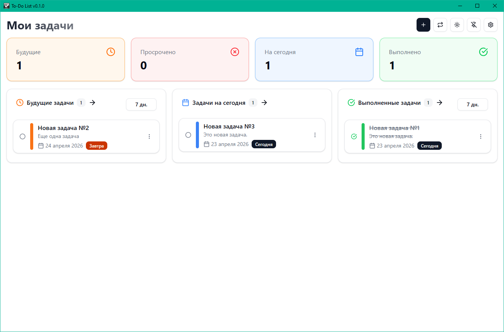
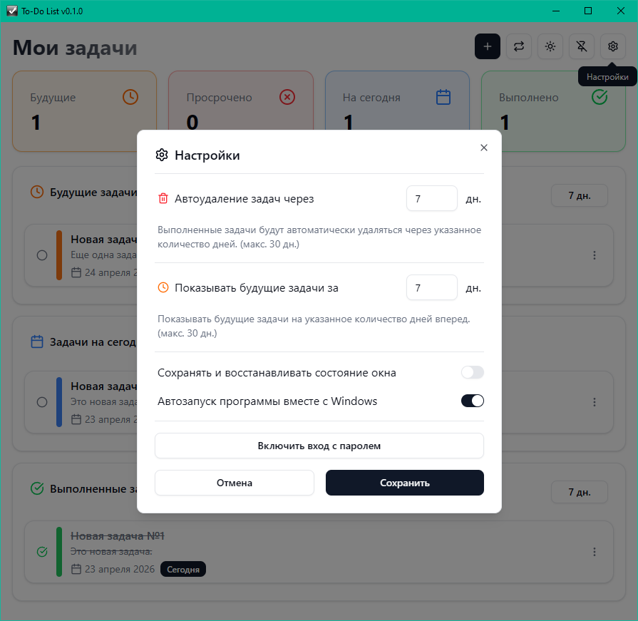
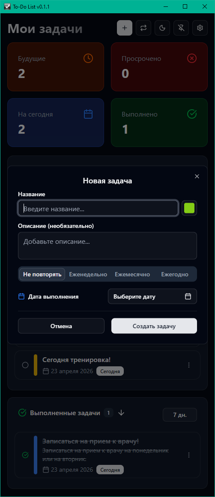
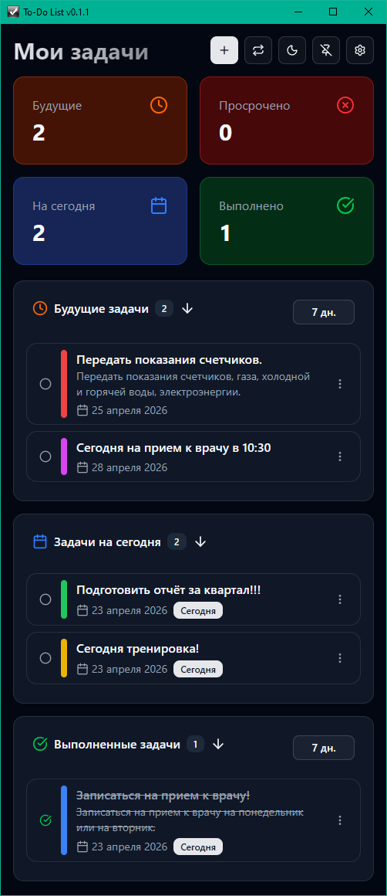

# 📋 To-Do List — Менеджер задач с шифрованием

**To-Do List** — это десктопное приложение для управления задачами, созданное на базе современного стека **Tauri + SvelteKit + TypeScript**. Оно позволяет удобно вести список дел, создавать повторяющиеся шаблоны задач и защищать данные паролем с помощью шифрования.

> 🧠 **Важно:** Я не являюсь профессиональным программистом. Весь процесс разработки этого приложения был полностью осуществлён с использованием технологий искусственного интеллекта (ИИ). Код может содержать недочёты или нестандартные решения, но я старался сделать его максимально функциональным и безопасным.

## 📸 Скриншоты

<p align="center">
  
  
</p>
<p align="center">
  
  
</p>

## ✨ Возможности

- ✅ **Управление задачами** — создание, редактирование, удаление и отметка о выполнении
- 🔄 **Повторяющиеся шаблоны** — создавайте шаблоны задач, которые автоматически создаются по расписанию (каждый день, неделю, месяц и т.д.)
- 🔒 **Шифрование данных** — защитите свои задачи паролем с использованием криптографического шифрования (AES-GCM)
- 🎨 **Настраиваемая цветовая метка задачи** — меняйте цветовые метки задач под свои предпочтения
- 🌙 **Тёмная тема** — поддержка светлой и тёмной темы оформления
- ⚙️ **Гибкие настройки** — автозапуск при старте системы, всегда поверх всех окон, сохранять и восстанавливать состояние окна
- 🔄 **Автоматическое обновление версий** — скрипт для автоматического обновления версии приложения в заголовке окна

## 🛠️ Технологии

| Компонент | Технология |
|-----------|-----------|
| **Фреймворк** | [Tauri](https://tauri.app/) v2 |
| **Frontend** | [SvelteKit](https://kit.svelte.dev/) + [TypeScript](https://www.typescriptlang.org/) |
| **UI-компоненты** | [shadcn-svelte](https://shadcn-svelte.com/) (на основе Melt UI) |
| **Стили** | [Tailwind CSS](https://tailwindcss.com/) |
| **Backend (Rust)** | [Tauri](https://tauri.app/) + [Cargo](https://doc.rust-lang.org/cargo/) |

## 📦 Установка и запуск

### Требования

- [Node.js](https://nodejs.org/) (v18 или новее)
- [Rust](https://www.rust-lang.org/)
- [Git](https://git-scm.com/)

### Установка

```bash
# Клонировать репозиторий
git clone https://github.com/your-username/to-do-list.git
cd to-do-list

# Установить зависимости
npm install

# Запустить в режиме разработки
npm run tauri:dev
```

### Сборка

```bash
npm run tauri:build
```

Готовый установщик будет создан в папке `src-tauri/target/release/bundle/`.

## 🗂️ Структура проекта

```
├── src/                  # SvelteKit-приложение (фронтенд)
│   ├── lib/
│   │   ├── components/   # UI-компоненты
│   │   ├── services/     # Сервисы (повторяющиеся задачи и т.д.)
│   │   ├── stores/       # Хранилища состояния (таски, настройки, темы)
│   │   ├── types/        # TypeScript-типы
│   │   └── utils/        # Утилиты (логирование и т.д.)
│   └── routes/           # Страницы приложения
├── src-tauri/            # Tauri-бэкенд на Rust
│   ├── src/
│   │   ├── lib.rs        # Логика на Rust
│   │   └── main.rs       # Точка входа
│   └── tauri.conf.json   # Конфигурация Tauri
├── static/               # Статические файлы (иконки)
└── scripts/              # Вспомогательные скрипты
```

## 🔐 Безопасность

Приложение использует **AES-GCM шифрование** для защиты данных задач. Пароль, который вы устанавливаете, используется для генерации ключа шифрования. Данные шифруются перед сохранением и расшифровываются только при вводе правильного пароля.

> **Примечание:** Если вы забудете пароль, восстановить данные будет невозможно. Храните пароль в надёжном месте.

## 📄 Лицензия

Это приложение распространяется **полностью бесплатно**. Вы можете свободно использовать, изменять и распространять его в соответствии с условиями лицензии **MIT License**.

Подробнее — в файле [LICENSE](LICENSE).

## ⚠️ Отказ от ответственности

Данное программное обеспечение предоставляется «как есть», без каких-либо гарантий, явных или подразумеваемых. Автор не несёт ответственности за любые прямые или косвенные убытки, возникшие в результате использования данного приложения.

Хотя приложение использует шифрование для защиты данных, автор не гарантирует абсолютную безопасность или отсутствие уязвимостей. Используйте программу на свой страх и риск.

**Особые положения:**

- Автор не является профессиональным программистом и не имеет профильного образования в области разработки программного обеспечения.
- Весь код был создан с использованием инструментов искусственного интеллекта (ИИ) и может содержать ошибки, недочёты или неоптимальные решения.
- Приложение не предназначено для хранения критически важных или конфиденциальных данных, требующих повышенного уровня защиты.
- Автор не гарантирует совместимость со всеми версиями операционных систем и аппаратным обеспечением.
- Используя данное программное обеспечение, вы принимаете на себя все риски, связанные с его использованием.

## 🙏 Благодарности

- Сообществу [Tauri](https://tauri.app/) за отличный фреймворк
- Разработчикам [Svelte](https://svelte.dev/) и [SvelteKit](https://kit.svelte.dev/)
- [shadcn-svelte](https://shadcn-svelte.com/) за красивые UI-компоненты
- Всем пользователям, которые тестировали приложение и делились обратной связью

---

<p align="center">
  <sub>Создано с ❤️ с использованием ИИ</sub>
</p>
