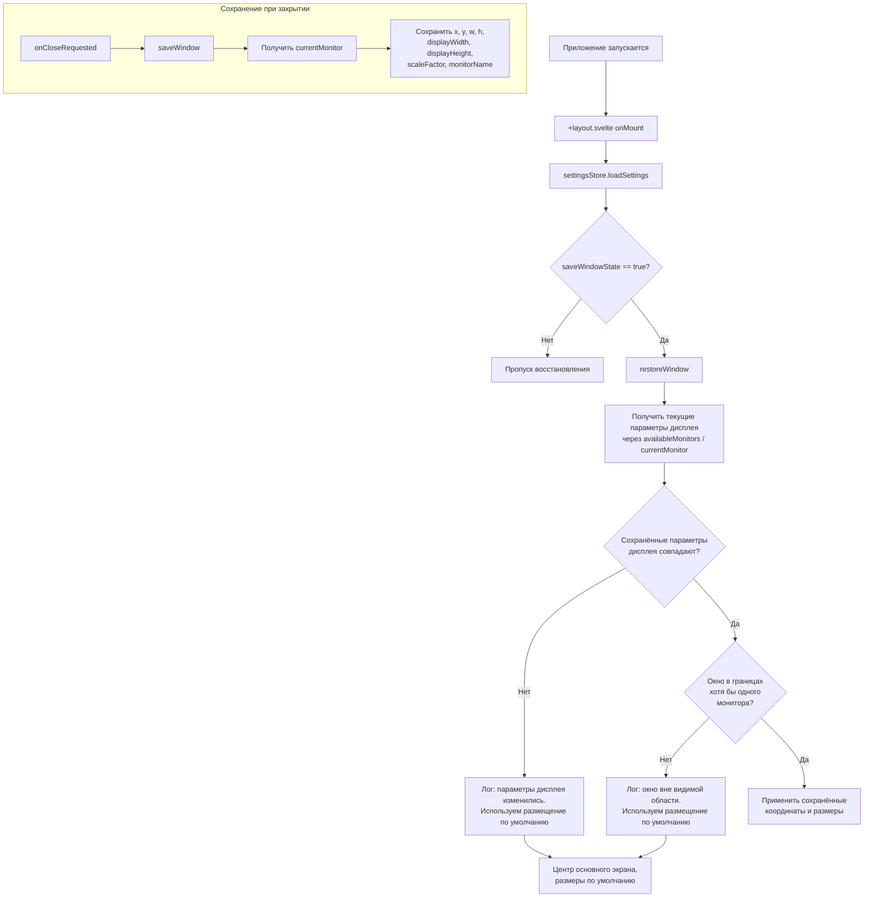

# План: Надёжное восстановление положения и размеров окна

## Обзор

Доработка механизма сохранения/восстановления окна с учётом изменений параметров дисплея (разрешение, DPI, конфигурация мониторов). Решение реализуется полностью на фронтенде (TypeScript/Svelte) с использованием Tauri v2 Monitor API, без изменения Rust-кода.

---

## Архитектурная схема



---

## Детальный план реализации

### 1. Расширение типа `windowState`

**Файл:** [`src/lib/types/types-settings.ts`](src/lib/types/types-settings.ts:6)

```typescript
windowState?: {
    // Координаты и размеры окна (существующие)
    x: number;
    y: number;
    width: number;
    height: number;
    isMaximized: boolean;

    // Параметры дисплея на момент сохранения (НОВЫЕ)
    displayWidth: number;    // Разрешение экрана по ширине (физические пиксели)
    displayHeight: number;   // Разрешение экрана по высоте (физические пиксели)
    scaleFactor: number;     // Коэффициент масштабирования (DPI): 1.0, 1.25, 1.5...
    monitorName: string | null; // Идентификатор монитора (null если не определено)
} | null;
```

### 2. Вспомогательная функция `getCurrentDisplayInfo()`

**Файл:** [`src/lib/stores/window-state.ts`](src/lib/stores/window-state.ts:1)

```typescript
interface DisplayInfo {
    displayWidth: number;
    displayHeight: number;
    scaleFactor: number;
    monitorName: string | null;
}

async function getCurrentDisplayInfo(): Promise<DisplayInfo>
```

**Логика:**
1. Вызывает `appWindow.currentMonitor()` — получает монитор, на котором окно сейчас
2. Если `currentMonitor()` возвращает `null` (окно не на мониторе), использует `primaryMonitor()`
3. Извлекает: `monitor.size.width`, `monitor.size.height`, `monitor.scaleFactor`, `monitor.name`
4. Возвращает объект `DisplayInfo`

### 3. Вспомогательная функция `isWindowInBounds()`

**Файл:** [`src/lib/stores/window-state.ts`](src/lib/stores/window-state.ts:1)

```typescript
async function isWindowInBounds(
    x: number, y: number, width: number, height: number
): Promise<boolean>
```

**Логика:**
1. Вызывает `availableMonitors()` — получает список всех мониторов
2. Для каждого монитора вычисляет его физический прямоугольник:
   - `left = monitor.position.x / monitor.scaleFactor`
   - `top = monitor.position.y / monitor.scaleFactor`
   - `right = left + monitor.size.width / monitor.scaleFactor`
   - `bottom = top + monitor.size.height / monitor.scaleFactor`
3. Проверяет пересечение прямоугольника окна `{x, y, x+width, y+height}` с прямоугольником каждого монитора
4. Возвращает `true`, если окно хотя бы частично (например, >= 50px по каждой оси) видимо на любом мониторе
5. **Важно:** координаты окна из `outerPosition()` — логические; координаты монитора из Tauri API — физические. Нужно привести к одной системе через `scaleFactor`.

### 4. Доработка `saveWindow()`

**Текущая логика:**
```
Получить x, y, width, height, isMaximized → сохранить в settingsStore
```

**Новая логика:**
```
Получить x, y, width, height, isMaximized
↓
Вызвать getCurrentDisplayInfo()
↓
Сохранить в settingsStore объединённый объект:
  { x, y, width, height, isMaximized, displayWidth, displayHeight, scaleFactor, monitorName }
```

### 5. Доработка `restoreWindow()`

**Новая логика:**

```
1. Проверить saveWindowState и наличие windowState в настройках
2. Получить текущие параметры дисплея через getCurrentDisplayInfo()
3. Сравнить сохранённые displayWidth, displayHeight, scaleFactor с текущими
   → Допуск: scaleFactor ±0.01 (погрешность float)
4. Если мониторов несколько — проверить, существует ли сохранённый monitorName
   в списке availableMonitors()
5. Если параметры НЕ совпадают:
   → console.warn("Window state rejected: display parameters changed", {saved, current})
   → Использовать стандартное размещение (не применять координаты)
6. Если параметры совпадают:
   → Вызвать isWindowInBounds(x, y, width, height)
   → Если окно вне границ:
      → console.warn("Window state rejected: window out of bounds", {x, y, width, height})
      → Использовать стандартное размещение
   → Если окно в границах:
      → Применить координаты как раньше (setPosition + setSize или maximize)
```

### 6. Стандартное размещение

Когда восстановление отклонено, окно использует параметры из [`tauri.conf.json`](src-tauri/tauri.conf.json:14):
- `width: 800`, `height: 600`
- `center: true` (центрирование основного экрана)

Tauri автоматически центрирует окно при `"center": true`, поэтому дополнительных действий не требуется — просто не применяем сохранённые координаты.

---

## Файлы, затронутые изменениями

| Файл | Тип изменений |
|---|---|
| `src/lib/types/types-settings.ts` | Расширение интерфейса `windowState` |
| `src/lib/stores/window-state.ts` | Добавление `getCurrentDisplayInfo()`, `isWindowInBounds()`, доработка `saveWindow()` и `restoreWindow()` |

Файлы **не требуют изменений:**
- `src-tauri/*` — без изменений Rust-кода
- `src/routes/+layout.svelte` — сигнатуры вызовов не меняются
- `src/lib/stores/settings-store.svelte.ts` — `DEFAULT_SETTINGS.windowState: null` остаётся без изменений

---

## Обработка граничных случаев

| Ситуация | Поведение |
|---|---|
| Смена разрешения (1920×1080 → 1366×768) | Отказ восстановления: `displayWidth/Height` не совпадают |
| Изменение DPI (100% → 125%) | Отказ восстановления: `scaleFactor` не совпадает |
| Отключение второго монитора | Отказ восстановления: `monitorName` не найден в `availableMonitors()` |
| Окно смещено за границу экрана | Отказ восстановления: `isWindowInBounds()` = false |
| Окно частично видимо (≥50px) | Разрешено восстановление |
| Первый запуск (нет сохранённого состояния) | `windowState === null` → стандартное размещение |
| `saveWindowState === false` | Ни сохранение, ни восстановление не выполняются |
